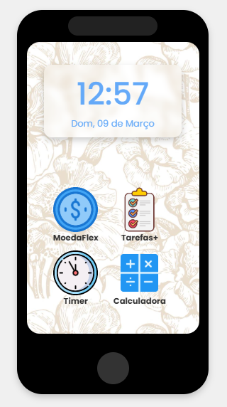
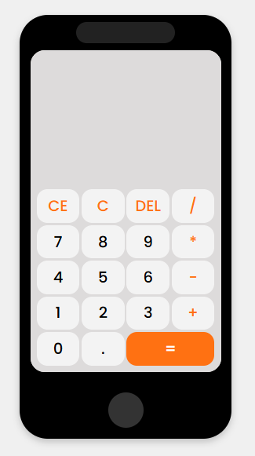
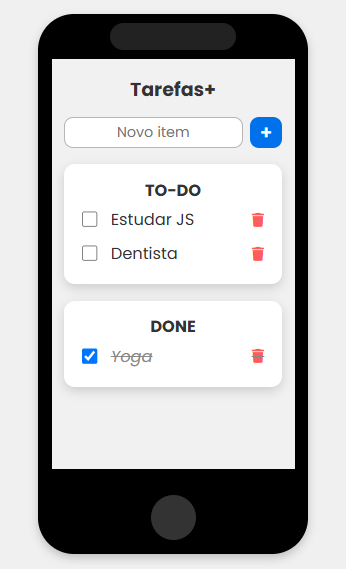
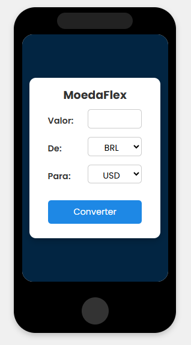
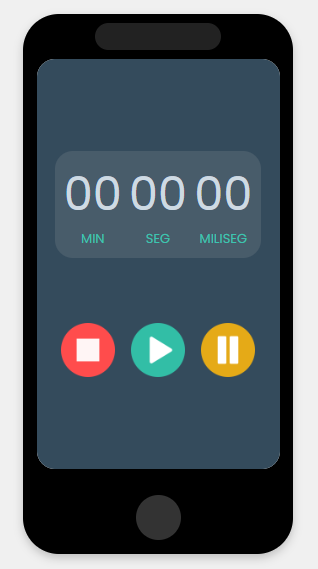

# 📱 JSPhone - Aplicativos em JavaScript

Este repositório reúne diversos projetos desenvolvidos para praticar JavaScript, organizados dentro de uma interface que simula um celular. A ideia é consolidar os principais exercícios comuns para iniciantes em um único projeto.

## Recursos Principais

### 🕒 Tela Inicial:

- Relógio e data em tempo real atualizados a cada segundo.
- Botão "Home" para retornar à tela inicial de qualquer aplicativo.

### 📲 Aplicativos Integrados

  - **Calculadora**: Operações básicas (soma, subtração, multiplicação, divisão).
  
  
  - **Lista de Tarefas**: Adicione, marque como concluídas ou remova tarefas. Armazena tarefas no localStorage, garantindo que os itens permaneçam salvos após recarregar a página.
  
  
  - **Conversor de Moedas**: Consome uma API externa para converter valores entre diferentes moedas.
  
  
  - **Cronômetro**: Funcionalidades de iniciar, pausar e resetar. Mantém a contagem mesmo após navegar entre apps.
  

Todos os aplicativos são gerados dinamicamente com JavaScript.

### 🛠️ Tecnologias Utilizadas
  - **JavaScript Vanilla**.
  - **HTML5 e CSS3**.
  - **LocalStorage** para persistência de dados da lista de tarefas.
  - **AwesomeAPI** para conversão de moedas.
